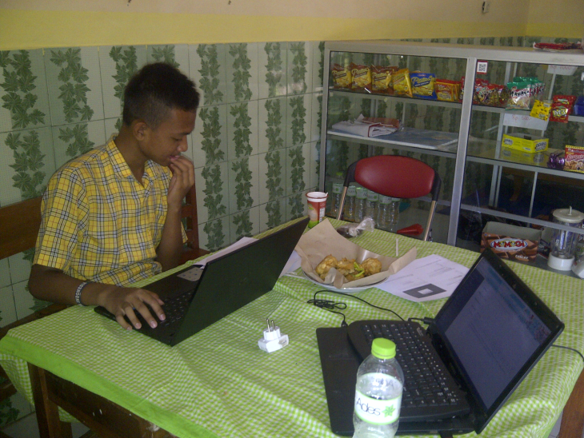

Saya memiliki murid. Tapi saya lebih suka menjadi temanya. Berbeda dengan Siswan lainnya, dia tidak dianugerahkan indera yang lengkap. Maka, bersyukurlah kita yang memiliki kesempuranaan indera. Beberapa waktu yang lalu, Ibu dari teman saya yang seorang guru meminta saya untuk mengajari muridnya membuat Tokon online. Mengapa?

Karena anak itu akan mengikuti Lomba E-commerce di tingkat Jawa Timur. Berbeda dengan sekolah lainnya, Sekolah tersebut adalah sekolah siswa berkebutuhan Khusus. Pertama kali bertemu, siswa tersebut sangat bersemangat sekali untuk tau lebih banyak. Sebelum berdiskusi dengan guru Zain (Nama siswa tersebut) saya sempat ditunjukkan Juknis (Petunjuk Teknis) dari Lomba.

Saya membaca dengan seksama. Xampp dan Opencart. Teknologi yang ditawarkan panitia untuk membangun E-commerce. Peserta diharuskan membawa laptop dan peralatan sendiri. Setelah saya lihat, Laptop yang dipersiapkan untuk Lomba memakai Sistem Operasi Windows 7. Untuk siswa seperti Zain, Hal tersebut sudah cukup. Saya belum berkeinginan untuk menawarkan menggunakan Sistem Operasi berbasia GNU/Linux. Pasalnya, Guru Zain ingin memfokuskan untuk membangun Toko Onlinenya saja.

Pertemuan pertama, saya mengajarkan instalasi Xampp. Tentu di Windows 7, saya hanya tinggal menyiapkan file .exe nya. Sebelum itu, saya juga mengunduh Opencart versi 2. Sebagai Info, [Opencart](https://www.opencart.com) merupakan platform toko online berbasis open source. Memakai teknologi MVC.

Awalnya, Saya sempat ragu ini akan berjalan lancar, mengingat Zain juga anak berkebutuhan khusus. Untuk berkomunikasi saja awalnya saya kesulitan. Namun, setelah melihat perkembangannya, Zain cepat beadaptasi, Bahkan dengan beberapa kali instruksi, dia sudah bisa menginstall dan menyiapkan web server aktif beserta mengeceknya pada browser. Saya sangat senang bisa mengajari ( belajar bersama) dengan Zain. Semangatnya tidak kalah dengan siswa lainnya. Akhir-akhir ini saya tau, dia suka bermain game online. Langkah bagus untuk memulai membiasakan diri di dunia IT. Jadi, Tidak selamanya game online itu buruk. Control diri yang peru dijaga agar tidak mengambil waktu dari aktifitas lain.

Pertemuan-pertemuan selanjutnya, Zain sudah semakin akrab dengan saya. Meskipun saya harus memahami lebih bahasa isyarat yang dia pakai (maklum, saya tidak tau sama sekali bahasa isyarat). Saya hanya improvisasi.

Semoga apa yang saya pelajari bermanfaat untuknya, Meskipun saya berharap Zain bisa mendapatkan temapt dalam lomba. Saya lebih berharap dia bisa beradaptasi dengan baik dengan teknologi saat ini.
