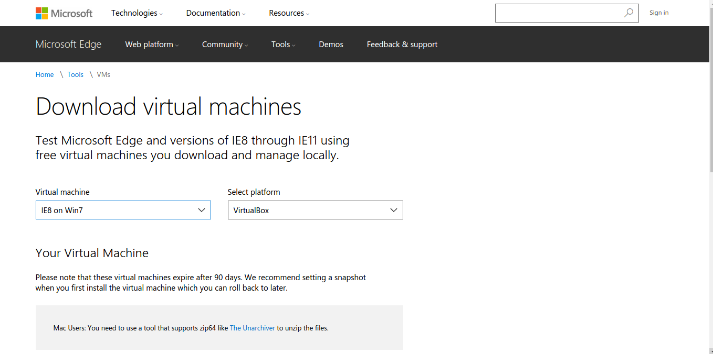
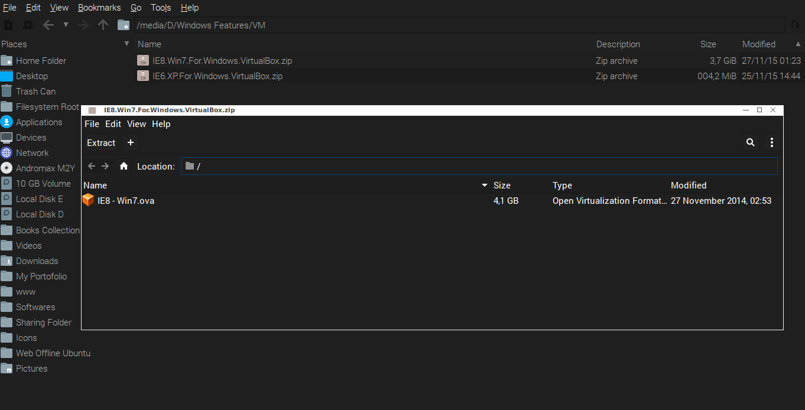
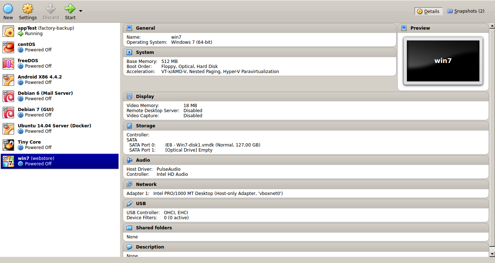
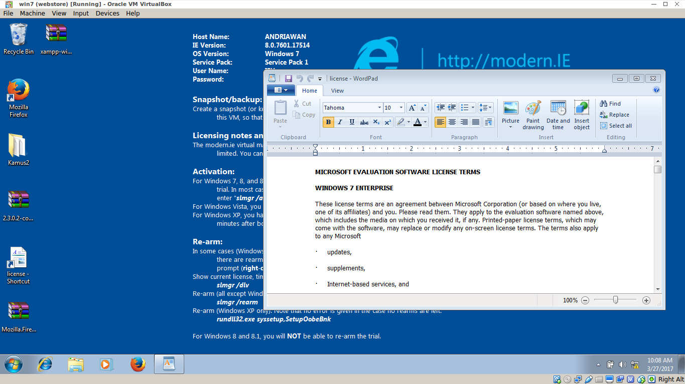
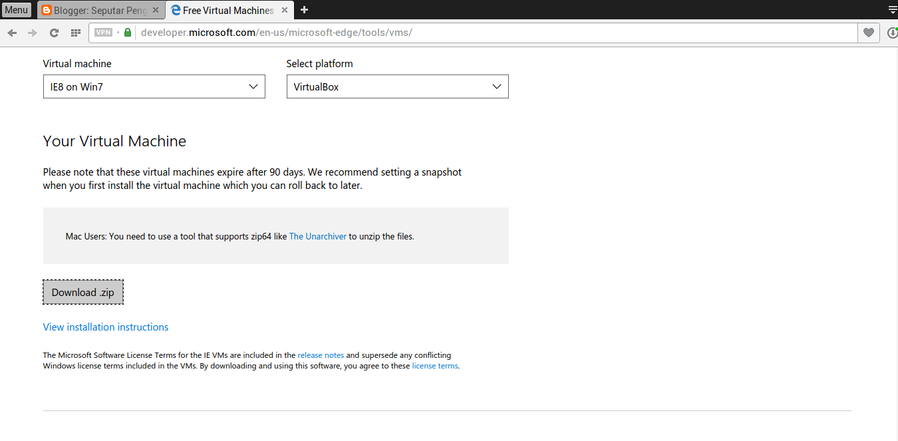

Saat ini saya memang menggunakan 100% GNU/Linux Environment. Terkadang, saya juga rindu untuk menggunakan OS Windows. Meskpun hanya sekedar rindu beberapa fiturnya saja. Dari rindu, saya pun mulai penasaran. Terpikir dibenak saya untuk melakukan eksplorasi jeroan Windows. Tentu tanpa mengubah apapun di dalamnya. Saya pun mulai mencari referensi yang mengarah ke sana.

"Bagaimana saya bisa menggunakan Windows tanpa melanggar lisensi ?" saya pun mencoba untuk terus melakukan pencarian. Akhirnya saya tertarik dengan program resmi dari Microsoft. Semua berawal dari laman [ini](https://developer.microsoft.com/en-us/microsoft-edge/tools/vms/)

Pihak Microsoft menawarkan virtual machines untuk OS terbaiknya. Awalnya, saya tidak begitu yakin. Namun, saya coba menelusurinya lebih jauh. Ada 2 Dropdown menarik disana. Pengunjung diharuskan memilih **Virtual Machine** dan **Platform**. **Virtual Machine** diteknologi oleh IE. Saya pun memilih IE8 on Win7 dengan Platform Virtualbox. Saya masih tidak percaya Windows OS bisa begitu saja di download walaupun dalam bentuk Virtual Machine.

Saya harus sabar menunggu, mengingat besar Virtual OS yang harus didownload sebesar **3,7 GB**. Setelah terdownload, saya mendapati isi dari berkas zip ialah berkas bernama IE - Win7.ova (Open Virtualization Format) sebesar **4,1 GB**.

Tanpa ragu, saya mencoba mengekstrak berkas zip tersebut dan mencobanya di Virtualbox. Virtualbox secara otomatis akan mengenali berkas .ova dengan pengaturan default dari berkas tersebut. Setelah menunggu lagi ( banyak-banyaklah bersabar ) hingga konfigurasi Virtualbox selesai. Windows 7 VM pun siap saya coba.

Ternyata memang benar. Virtual Machine Windows 7, 90% sama dengan OS aslinya. setelah masuk Desktop awal, saya melihat ada berkas teks. Berkas tersebut adalah **Term and Agreement License**. Sejauh yang saya paham Virtual Machine Windows 7 digunakan untuk review saja. Tidak diperkenankan untuk tujuan komersil. Bagi saya itu sudah cukup untuk melakukan eksplorasi jeroan Windows.

Selain itu untuk Virtual Machine Windows 7, pengguna hanya diberikan waktu penggunaan sampai batas aktivasi selama 90 hari. Jika ingin lebih, silahkan ikuti instruksi pada Wallpaper desktop. Uniknya, pihak Microsoft menyarankan untuk membuat snapshot pada Virtual Machine anda. Hal ini dilakukan untuk menghindari masa aktivasi 90 hari. Anda yang sudah mahir menggunakan Virtualbox pastinya tau tentang snapshot. Singkatnya, snapshot merupakan fitur pada Virtualbox yang berkerja seperti checkpoint. ketika anda menambahkan aplikasi tertentu, dan ingin mengembalikannya ke kondisi sebelum instalasi aplikasi, anda harus membuat snapshot terlebih dahulu.Informasi lebih lanjut tentang snapshot, silahkan kunjungi laman [manual resmi virtualbox](https://www.virtualbox.org/manual/ch01.html#snapshots).

Anda tertarik? silahkan lakukan eksplorasi. Ingat gunakan selalu Software sesuai peruntukannya. Hindari melakukan pelnggaran lisensi. GNU/Linux bisa memberikan solusi utama bagi anda yang membutuhkan Kreatifitas tinggi tanpa adanya control dari pihak lain.
