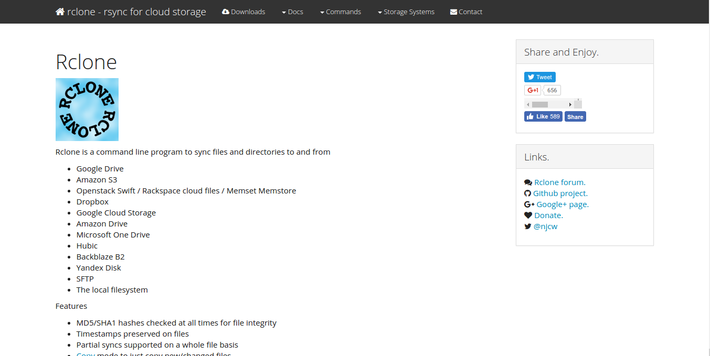

Sebenarnya saya sudah lama menggunakan tool sederhana ini. Beberapa waktu yang lalu saya sempat bereksperimen dengan [rsync](https://en.wikipedia.org/wiki/Rsync). Saya begitu takjub dengan fiturnya. Berbeda dengan copy file pada umumnya, rsync memiliki fitur mengenali serangkaian file yang sudah ada pada destination path sehingga kita hanya perlu mengcopy berkas termodifikasi atau berkas baru. Jika anda pernah berkerja dengan git, Anda akan sedikit familiar dengan rsync.

Lebih jauh, saya bertanya. Adakah tools berbasis rsync yang terintergrasi dengan layanan penyimpanan berbasis cloud? Saya menemukan [Rclone](http://rclone.org/).

Rclone merupakan tool berbasi CLI yang sampai saat ini, ketika tulisan ini dibuat, telah terintegrasi dengan beberapa Cloud storage.

Kabar baiknya, anda bisa melihat langsung sumber kode dari Rclone di [Github](https://github.com/rclone/rclone). Rclone dibangun menggunakan bahasa GO dan didistribusikan ke banyak platform. Rclone berada di bawah MIT license. Penggunaanya juga tidak terlalu rumit. Hampir sama dengan baris perintah rsync. Bagi anda yang memiliki frekuensi backup data yang tinggi, Namun ingin memprioritaskan keamanan data anda, anda bisa coba tools ini.
