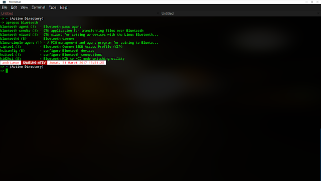
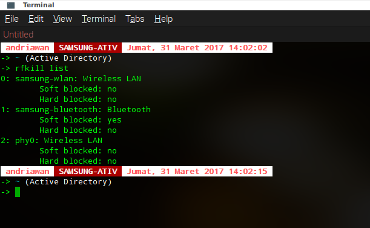
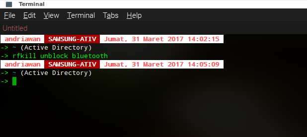
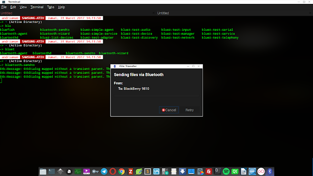
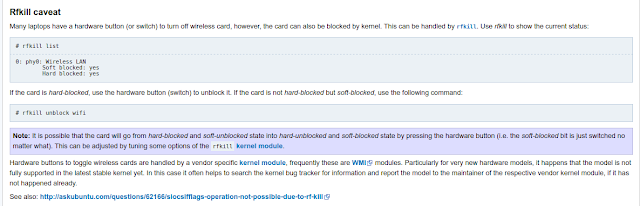

import CodeBlock from "../src/components/CodeBlock";

Sebelum ke pembahasan detail, saya akan bercerita pengalaman saya sedikit. Laptop saya dilengkapi dengan Bluetooth. Namun, sudah lama tidak saya pakai semenjak ada Koneksi yang lebih cepat dan stabil yaitu Wireless Fidelity Connection (Wifi). Beberapa hari yang lalu saya mencoba mengirim berkas melalui handset Blackberry 9810 melalui jaringan Wifi.

Melihat sistem yang dipakai berbasis java, mau tidak mau saya mencoba mencari tools transfer berkas dengan jaringan Wifi. Ternyata, tool tersebut tidak berjalan maksimal. Saya memutuskan untuk menggunakan jaringan bluetooth. Karena sudah beberapa waktu tak terpakai, saya berasumsi bluetooth saya tidak memiliki masalah. Saya mecoba membuka tool bluetooth-wizard dari terminal. Keluarlah GUI pencarian device melalui jaringan bluetooth. Setelah saya tunggu cukup lama, ternyata tidak ada respon. Saya pikir ada yang salah dengan bluetooth saya. Saya mencoba mencari tau lewat command-command yang berhubungan dengan bluetooth.

Dengan segala cara dan upaya, saya masih belum bisa memecahkan masalah ini. Kemudian saya mencari referensi. Beberapa referensi merujuk pada rfkill. Saya mencari tau langsung dengan mengeksekusi

<CodeBlock>
    <code className={`language-bash`}>
        rfkill list
    </code>
</CodeBlock>

Ada yang aneh dengan bluetooth saya dari hasil di atas. Soft Blocked : yes. saya mencoba untuk membuatnya unblock dengan perintah baris berikut

<CodeBlock>
    <code className={`language-bash`}>
        rfkill unblock bluetooth
    </code>
</CodeBlock>

lalu saya coba cek dengan bluetooth-sendto untuk mengirim berkas foto ke Blackberry 9810. File terkirim. Sekarang saya tau sumber masalahnya. Saya mencoba mencari tau lebih dalam perihal rfkill.

dari dua sumber favorit saya ArchWiki dan kernel.org saya mencoba memahami mekanisme rfkill. dalam lama kernel.org. rfkill dijelaskan sebagai berikut:

> rfkill is a small userspace tool to query the state of the rfkill switches, buttons and subsystem interfaces. Some devices come with a hard switch that lets you kill different types of RF radios: 802.11 / Bluetooth / NFC / UWB / WAN / WIMAX / FM. Some times these buttons may kill more than one RF type. The Linux kernel rfkill subsystem exposes these hardware buttons and lets userspace query its status and set its status through a /dev/rfkill. Given that at times some RF devices do not have hardware rfkill buttons rfkill the Linux kernel also exposes software rfkill capabilities that allows userspace to mimic a hardware rfkill event and turn on or off RF

sementara dari ArchWiki

Perangkat wireless punya dua kondisi. Hard Blocked dan Soft Blocked. Kondisi Hardware blokced berhubungan dengan fisik hardware seperti button switch pada Bluetooth maupun WLAN. Laptop modern sudah mengintegrasikannya pada kombinasi tombol keyborad. Sedangkan soft blocked berhubungan dengan kernel. Beberapa tipe laptop tertentu belum menyempurnakan fitur ini pada kernel stabil. jadi memang banyak bermunculan masalah wifi card tidak muncul pada saat mengeksekusi perintah ifconfig. Tombol untuk menyalakan Wifi maupun bluetooth pada laptop tertentu dihandle oleh kernel modul. Modul tersebut berhubungan dengan spesifikasi vendor pembuatnya.

Langkah ini saya tulis berasarkan pengalaman saya. Jika ada metode yang lebih bagus dan efektif, tidak menutup kemungkinan saya juga akan menerapkannya. Intinya, anda tau permasalahnnya dan tau bagaimana cara menanganinya
