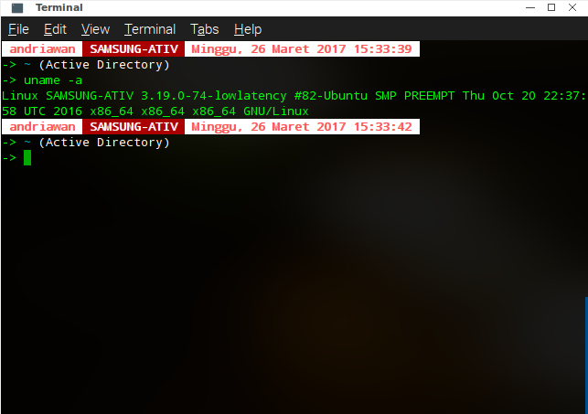
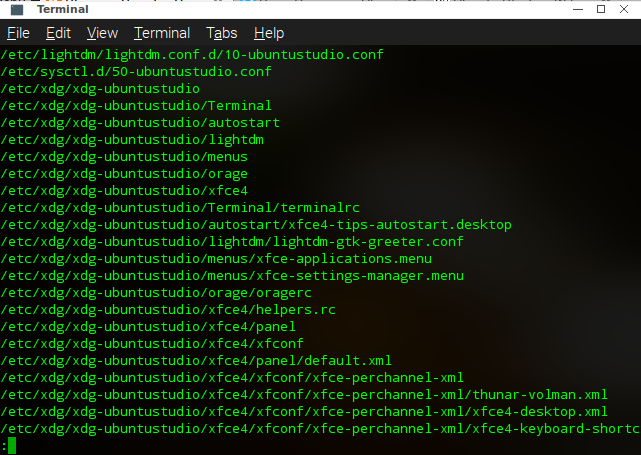

import CodeBlock from "../src/components/CodeBlock";

Sudah berapa lama saya memakai Ubuntu Studio sebagai sistem operasi utama saya? Jawabannya ada pada beberapa utilitas berbasis CLI berikut:
<CodeBlock>
    <code className={`language-bash`}>
        uname -a
    </code>
</CodeBlock>

Pertama saya pastikan terlebih dahulu informasi Sistem Operasi yang sudah saya gunakan dengan mengeksekusi tool di atas ( Jika anda belum terbiasa menggunakan command line interface sebaiknya anda berkunjung ke laman wikipedia ).

Ternyata saya hanya mendapatkan beberapa informasi saja. Dari situ, saya mengetahui jika saat ini Sistem operasi saya memakai kernel 3.19.0-74-lowlatency dengan aristektur x86_64. Saya juga mendapatkan informasi tentang nama komputer saya **SAMSUNG-ATIV**. Lalu bagaimana saya tau versi Ubuntu yang saya gunakan. Jawabannya ada pada tool selanjutnya

<CodeBlock>
    <code className={`language-bash`}>
        lsb_release -a
    </code>
</CodeBlock>

Saat ini, saya tidak akan fokus pada tool atau utilitas tersebut, karena saat ini saya akan memberikan informasi sejelas-jelasnya mengenai Sistem Operasi yang sedang saya pakai. Jika perintah diatas dieksekusi (tekan enter pada terminal), maka akan tampil informasi berikut

Akhirnya saya tau versi Ubuntu saya. Seperti yang bisa anda lihat saya adalah pengguna Ubuntu 15.04 dengan codename Vivid. Lalu bagaimana saya tau kalau saya menggunakan varian Ubuntu dengan nama Ubuntu Studio? pada tahap ini saya pun kesulitan menemukan informasi tentang ubuntu studio dalam sistem operasi yang saya pakai. akhirnya saya berinisiatif menggunakan command

<CodeBlock>
    <code className={`language-bash`}>
        locate ubuntustudio | less
    </code>
</CodeBlock>

command diatas akan mencari semua informasi baik folder ataupun file terkait kata ubuntustudio sedangkan | less akan menampilkan hasilnya perlayar, jadi bisa discroll menggunkan key up atau down. Hasil yang saya dapat adalah:

setidaknya saya tau ubuntustudio ada dalam sistem operasi saya. Selanjutnya, saya ingin tau umur Ubuntu Studio saya. Dengan command dibawah saya dapat mengetahui umur Ubuntu Studio saya.

<CodeBlock>
    <code className={`language-bash`}>
        sudo tune2fs -l /dev/sda6 | grep "Filesystem created"
    </code>
</CodeBlock>

command diatas memakai sudo yang artinya memerlukan hak akses root. sedangkan /dev/sda6 adalah partisi sistem Ubuntu Studio berada. sedangkan pipeline | grep "Filesystem created" akan mencari keyword dalam tanda petik.

Ternyata saya sudah memakai **Ubuntu Studio 15.04**  dengan **kernel 3.19.0-74-lowlatency** aristektur **x86_64** sejak tanggal **28 Juni 2015**. Itu berarti saya telah menggunakan Ubuntu Studio selama hampir 2 Tahun.
