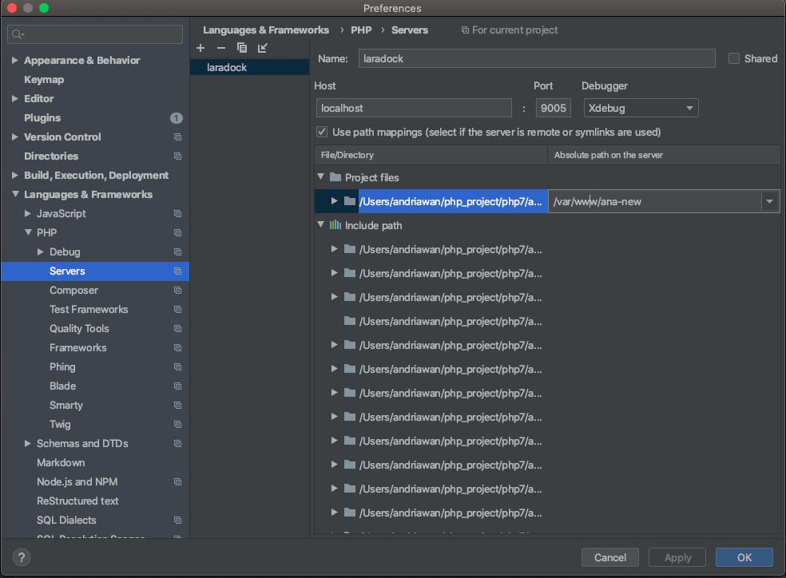

Ini merupakan tulisan pertama saya yang bersifat pembahasan teknis. Tulisan ini saya dedikasikan kepada [Kang Hendi](https://github.com/hendisantika). Beliau merupakan sponsor saya. Beliau mempercayakan klaim lisensi PHPstorm kepada saya untuk digunakan dalam produktifitas Development harian. InsyaAllah development kedepan bisa lebih produktif dengan PHPstorm.

Debugging memang hal cukup asing khususnya di ranah PHP development. Kebanyakan pemula (tidak terlepas saya juga) sering menggunakan metode sederhana dalam menganlisa kode, menemukan bug dan error logic pada kode. Metode `var_dump()` dan bahkan mungkin `echo` masih menjadi pilihan. Cara tradisional, namun mudah dan cukup populer. Nah, agar kita bisa menjadi developer yang baik dan benar, kita perlu mencari cara memudahkan hidup kita sendiri😄. Salah satunya dengan menerapkan teknik debugging.

Mengingat Xdebug memerlukan pengaturan khusus untuk bisa terintegrasi ke IDE populer zaman now macam Vscode dan PHPStorm, perlu adanya tutorial detail integrasi Xdebug ini. Pada artikel ini, saya akan coba jelaskan langkah-langkah integrasi Xdebug dengan kombinasi Docker dan PHPStorm IDE. Hal mendasar mengapa perlu adanya tutorial secara jelas dan lengkap ialah berdasarkan pada pengalaman pribadi saya.

Beberapa minggun ini saya berkutat dengan konfigurasi Xdebug. Saya coba mengumpulkan beberapa informasi. Istilah kerennya research😁. Beberapa tutorial memang bagus dan to do point. Namun, ada Beberapa hal yang mungkin terlihat sepele tapi jarang disebutkan secara jelas.

Tak kenal maka tak tahu😆. Mari kita berkenalan dulu dengan Xdebug.

## Apa itu Xdebug?🤔

Masih asing dengan istilah di atas? tidak masalah. Saya akan coba sederhanakan. Dari kata tersebut saya yakin Anda pasti dapat menebak. Yap, Anda benar. Xdebug berkorelasi dengan aktifitas debugging. Developer PHP veteran pastilah tidak asing dengan yang satu ini. Partner wajib PHP developer dalam berperang melawan kode bandel😅. Kode bandel biasanya disebabkan oleh diri kita sendiri. Jadi, sebenarnya saya mengajak Anda untuk melawan diri Anda sendiri agar lebih baik dalam menulis kode lewat debugging yang baik dan benar.

Anda ingin definisi resmi? Oke. Mari kita berkunjung ke laman resminya.

> Xdebug is an extension for PHP to assist with debugging and development.
- It contains a single step debugger to use with IDEs
- it upgrades PHP's var_dump() function
- it adds stack traces for Notices, Warnings, Errors and Exceptions
- it features functionality for recording every function call and variable assignment to disk
- it contains a profiler
- it provides code coverage functionality for use with PHPUnit

Berdasarkan kutipan di atas, kita bisa coba sederhanakan, xdebug merupakan penunjang debugging pada development PHP. Xdebug ini hadir dalam bentuk ekstensi. Jadi defaultnya, dia tidak tersedia saat install PHP. Pada tutorial kali ini, saya akan menggunakan Docker.

## Kenapa Docker?🤔

Saat ini docker sudah mulai banyak dilirik developer. Alasannya? saya pribadi sih pilih docker karena fleksibelitas. Terkadang kita butuh lingkungan pengembangan yang berbeda. Misal, kita butuh PHP 5 untuk development apliksai A. di sisi lain, kita juga develop aplikasi B dengan minum versi PHP 7. Dengan Docker kita bisa switch lingkungan pengembangan dengan mudah tanpa saling interfensi.

Saya sendiri memakai [Laradock](https://laradock.io) untuk aktifitas pengembangan PHP sehari-hari. Docker tidak akan secara detail dibahas di sini. Saya asumsikan Anda sudah familiar dengan docker Development. Anda bisa mengunjungi laman resmi dokumentasi [Docker](https://docs.docker.com/get-docker/) untuk memulai menerapkan development berbasis Docker.

Secara prinsip, konfigurasi Xdebug dari docker maupun dari tanpa docker sama. Karena memang Fokusnya bukan pada Dockernya, namun pada konfigurasinya. Pastikan dulu Xdebug telah terintegrasi ke PHP yang anda gunakan. Anda bisa periksa apakah Xdebug sudah terintegrasi dengan PHP yang anda pakai. Anda bisa memanfaat native API PHP `phpinfo()`

Screenshoot diatas merupakan hasil dari phpinfo yang mana Xdebug berstatus enabled. Xdebug siap dikonfigurasi bersama IDE PHPStorm.

## PHPStorm? Kenapa tidak Vscode?🤔

Sebenarnya saya sudah mencoba keduanya. Menurut saya pribadi konfigurasinya hampir sama. Yang membedakan ialah PHPStorm lebih user friendly. Semua konfigurasi Xdebug tersedia dalam bentuk UI yang memudahkan pengguna. Vscode lebih fleksibel karena kita menulis langsung konfigurasi dalam satu file khusus.

## Let's Do the Thing 💻

Pastikan anda sudah menyiapkan laradock pada lokal komputer anda. Jika belum, coba ikuti langkah langkahnya [disini](https://laradock.io/getting-started/). Laradock memakai command `docker-compose` untuk administrasi semua docker containernya. Langkah yang paling mudah ialah melakukan eksekusi command pad terminal `docker-compose up -d mysql apache2 phpmyadmin`

Perintah ini akan melakukan pengecekan apakah container docker sudah ada atau belum pada lokal komputer. Jika belum ada, docker akan mengunduh image yang dibutuhkan kemudian melakukan build sesuai resep [Dockerfile](https://docs.docker.com/engine/reference/builder/) yang ada. Jika kita perhatikan, folder Laradock akan berisi banyak folder dengan resep Dockerfile masing-masing. Dalam hal ini, kita hanya memerlukan service mysql, apache2 dan phpmyadmin. Perintah `-d` akan membuat service container berjalan dilatar belakang dalam mode `detach`. Pada mode ini, service container akan tetap berjalan dan Anda bisa beraktifitas kembali menggunakan terminal. Tanpa command `-d` posisi terminal Anda akan terus memantau service container dan jika Anda menekan key `ctr + c`, container anda Akan berhenti.

Untuk mengetahui apakah docker container berjalan dengan baik, Anda bisa melakukan eksekusi command
`docker-compose ps`

## Touch the .env File

Seperti yang saya sebutkan di awal, Xdebug merupakan ekstensi. Jadi kita harus integrasi dengan PHP. Sama dengan Laradock, Xdebug belum terintegrasi. Semua konfigurasi dan Administrasi container docker ada dalam satu single file `.env`. Banyak parameter yang bisa Anda atur, termasuk integrasi Xdebug. Silahkan buka file .env di dalam folder Laradock. Ada 2 parameter yang harus Anda ganti nilainya menjadi `true` yaitu `PHP_FPM_INSTALL_XDEBUG` dan `WORKSPACE_INSTALL_XDEBUG`. Apa sebenarnya ini? parameter ini akan mengirim perintah saat build container PHP untuk mengaktifkan Xdebug. Kenapa 2 parameter yang dibutuhkan? Menurut sumber resminya pada laman official Laradock, kita memang harus mengganti 2 parameter tersebut. Namun saya belum paham mengapa. Asumsi saya container workspace ini dibutuhkan pada internal eksekusi docker container Laradock.

Karena kita memelakukan perubahan pada parameter `.env`, container kita perlu dibuat ulang agar perubahan terbaru dapat diterapkan. Lakukan eksekusi `docker-compose build workspace php-fpm` untuk membuat kembali container php-fpm dan workspace. Jika berhasil, Anda seharusnya dapat melihat Xdebug aktif pada `phpinfo()`.

## Konfigurasi xdebug.ini

Selanjutnya, kita konfigurasi file `xdebug.ini` agar container dapat menerima perintah-perintah yang dimengerti Xdebug. File konfigurasi ini ada pada 2 tempat. Sama Seperti pada .env di atas, kita harus konfigurasi untuk container php-fpm dan workspace.

> Konfigurasi xdebug.ini
- xdebug.remote_enable=1
- xdebug.remote_autostart=1
- xdebug.remote_log=/var/www/xdebug.log
- xdebug.remote_connect_back=0
- xdebug.remote_port=9005
- xdebug.idekey=PHPSTORM
- xdebug.remote_host=docker.for.mac.localhost
- xdebug.remote_handler="dbgp"

Mari kita coba urai satu persatu. Ada cukup banyak parameter disana. Ada 3 menurut saya yang paling penting yaitu `remote_enable`, `remote_port` dan `remote_host`. 

- `remote_enable` mengaktifkan xdebug dalam mode remote. Karena kita menerapkan development berbasis docker Laradock, container service PHP menggunakan php-fpm dalam bentuk container tersendiri. Development kita berada di lokal, jadi kita butuh mengaktifkan remote ke container tersebut.

- `remote_port` beberapa artikel menyarankan port berbeda dengan port yang digunakan php-fpm yaitu 9000 secara defaultnya. Anda bisa mencoba port yang lain. Untuk tutorial ini saya memakai port 9005

- `remote_host` disini sebenarnya merupakan alamat host lokal kita, untuk case macOS docker memakai nama khusus `docker.for.mac.localhost`. Untuk kasus lain, penggunaan localhost ataupun 127.0.0.1 dapat digunakan.

- Penggunaan parameter lainnya anda bisa ikuti yang telah saya tulis di atas. Beberapa memang mungkin tidak diperlukan untuk case tertentu.

Seperti biasa, karena kita melakukan perubahan konfigurasi. Container kita perlu dibuat ulang. Jalankan perintah `docker-compose build workspace php-fpm`. Nak sekarang kita akan konfigurasi IDE-nya yaitu PHPStorm.

## Konfigurasi PHPStorm

Saya merupakan pengguna baru PHPStorm. Walapun saya sudah memakai salah satu produk berbasis [JetBrains](https://www.jetbrains.com) yaitu Android Studio. PHPStorm ini sangat cocok buat mereka yang ingin dimanjakan lewat UI yang user friendly. Hampir semua konfigurasi tersedia berbasis UI tanpa perlu membuat file konfigurasi sendiri. Untuk mengakses semua konfigurasi pilih menu preferences. Jika berbasis macOS anda cukup menekan tombol `⌘ + ,`.

 Banyak konfigurasi yang bisa Anda jelajahi. Untuk kali ini, pilih saja `Language & Frameworka > PHP > Debug`

Pada bagian Xdebug, silahkan sesuaikan Debug Port dengan konfigurasi awal yang kita telah tentukan. Pada screenshoot, saya isi 9005. Selanjutnya pilih bagian `Language & Frameworka > PHP > Servers`. Ini bagian yang paling penting menurut saya. Di sini, kita akan melakukan konfigurasi agar PHPStorm dapat terkoneksi ke server Xdebug. Ingat, Walapun kita install di localhost tanpa menggunakan docker, konsep client server masih berlaku. Yang akan membedakan nantinya pada path mappingnya.

Ada beberap parameter yang harus kita konfigurasi. Name, Host, Port dan Path mappingnya.

Name untuk based Laradock development menggunakan nama `laradock` sesuai konfigurasi `.env`. Anda dapat menemukan konfigurasi ini pada line 62. Jika anda merubah konfigurasi ini, maka Name pada konfigurasi di atas harus diubah juga.

Untuk Host silahkan isi `localhost` dan port sama dengan konfigurasi awal `9005`. Nah, karena kita menggunakan Laradock yang artinya kita meremote file PHP, kita perlu centang path mapping. Langkah ini yang menurut saya penting, karena saya waktu itu stuck di langkah ini 😂. Path mapping ini penting, agar xdebug bisa mengidentifikasi breakpoint dari file-file PHP kita. Saya sempat dibuat pusing, karena issue ini. Semua konfigurasi sudah berjalan, namun breakpoint tidak dapat dibaca xdebug. Sesuaikan saja path local dengan path pada container php-fpm kita. Kalau tidak yakin path remotenya, kita bisa masuk ke container `php-fpm` dengan menjalankan perintah `docker-compose exec php-fpm bash`. Biasanya path mapping file-file php berada pada folder `var/www/`

Konfigurasi selesai, Untuk beralih ke mode debug pada PHPStorm IDE,  Anda bisa aktifkan pada tombol icon seperti gambar di bawah. Posisinya ada di pojok kanan atas. Menagapa tidak menggunakan debug biasa? karena jika kita memakai mode debug biasa (tombol bericon kutu berwarna hijau) maka kita akan berada pada mode debug per File dan dieksekusi dengan PHP CLI. Pembahasan Debug CLI mode tidak akan dijelaskan detail di sini. Mungkin pada next artikel ya 😁. Kita berfokus pada keseluruhan debugging Aplikasi.

Silahkan anda coba membuat breakpoint pada file php Anda. Silahkan klik ke sebelah kanan line number. Akan muncul bulatan merah. Nah, itu yang dinamakan breakpoint.

Ketika kita mereload browser dalam contoh saya `index.php` maka browser akan terus reload. Kenapa? karena file kita berhenti dieksekusi. Eksekusi akan berhenti pada titik merah alias breakpoint.

Nah, dari situ anda akan tau kondisi variable-variable yang ada. Jika Anda perhatikan pada panel bawah, ada beberapa informasi variable Seperti `$_SERVER`,`$_COOKIE`. Dengan informasi yang cukup detail seperti ini, pengguna debug var_dump atau manual echo menurut saya sudah ter-cover di sini. Pada tingkat advanced, bahkan anda bisa menganlisa alur eksekusi kode Framework besar macam Laravel.

## Sum up!

Silahkan coba Anda terapkan teknik debugging ini Mungkin di awal-awal, teknik ini terlihat menyusahkan diri sendiri atau buang-buang waktu. Percayalah Bro😎, semakin komplek Aplikasi yang Anda bangun, debugging manual akan benar-benar merepotkan. Saya sudah membuktikannya in the real world case. Ya, kalau memang Anda butuh sesuatu yang simpel untuk Aplikasi simpel, teknik debugging ini mungkin saja akan menyita banyak waktu Anda. So, it's all yours.

