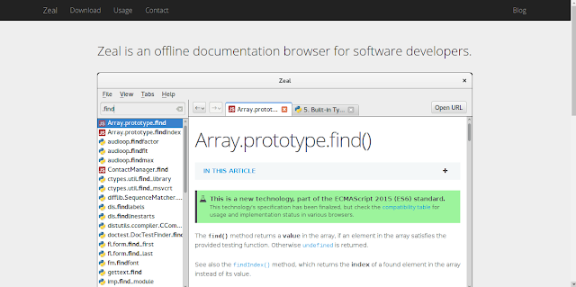
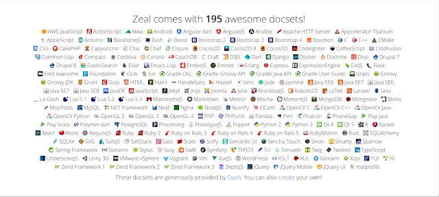
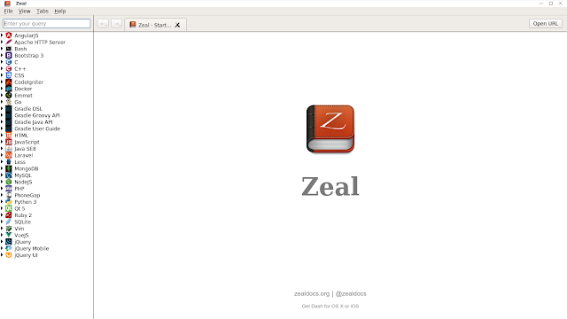
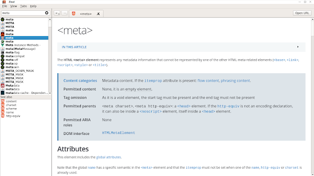

Tekadang dalam situasi tertentu, saya fokus untuk mendalami suatu bahasa pemrograman. Di sisi lain, saya perlu berinteraksi dengan bahasa yang lain. Kegiatan tersebut cukup menyita banyak waktu dan sumber daya. Beberapa bahasa pemrograman menyediakan dokumentasi secara Online. Itu artinya, saya harus memiliki koneksi internet.

Kegiatan ini, sering kali saya lakukan. Saya berfikir apakah ada tools yang bisa membuat kegiatan diatas sederhana? Saya menemukan jawabannya. [Zeal](https://zealdocs.org/)

Zeal merupakan tool dokumentasi secara offline. Dengan teknologi **docset**, Anda bisa menikmati dokumentasi bahasa pemrograman populer dalam satu tempat. Zeal mendukung lebih dari 190 Dokumentasi. Dokumentasi yang disediakan biasanya berbahas inggris disertai dengan tampilan yang fresh.

Saya akan tampilkan Zeal beserta dokumentasi yang ada pada Laptop saya. Ini merupakan tampilan awal Zeal. Di sebelah kiri, Terdapat deretan dokumentasi yang sudah diunduh ( Tiap dokumentasi, harus diunduh terlebih dahulu untuk kemudian digunakan secara Offilne ). Untuk mengunduhnya, anda perlu menjelajahi menu **File** kemudian pilih tab **Docsets**. Pilih dokumentasi sesuai dengan yang anda butuhkan.

Dengan menggunakan Zeal, Waktu yang anda butuhkan untuk mencari informasi dokumentasi dari setiap pemrograman akan lebih efektif. Lebih baik dari pada harus membuka tiap dokumentasi dari tiap pemrograman yang ada. Misal saya ingin mencari sebuah tag dalam html. Saya hanya perlu mengetikan keyword misal **meta**

Anda akan lebih produktif. Selain itu, Zeal akan memudahkan anda dalam mempelajari sebuah bahasa pemrograman baru. Suatu ketika anda lupa sebuah method atau anda penasaran dengan fungsi method tertentu pada suatu bahasa pemrograman, anda bisa langsung membuka Zeal.

Jika bermanfaat bagi aktifitas Programming anda, silahkan beritau orang lain agar sama-sama merasakan manfaatnya.
